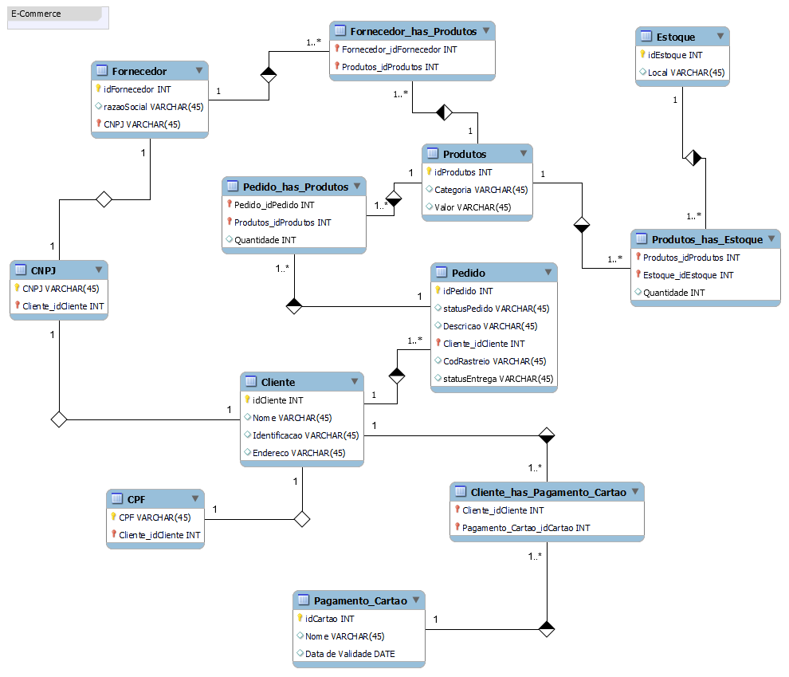

# Projeto Conceitual - Ecommerce

Desafio da plataforma [DIO](https://dio.me) (Digital Innovation One), no bootcamp [Database Experience](https://web.dio.me/track/database-experience).

## Sobre o desafio
O desafio consiste em realizar a modelagem de dados de um projeto de E-Commerce, onde existirão diversos requisitos afim de entender de maneira prática como funciona a modelagem de dados em um ambiente real.
As principais entidades do desafio são: 
- Cliente;
- Produto;
- Pedido;
- Estoque;
- Fornecedor.

## Dificuldades e aprendizados
- Conhecer os tipos de modelo de dados e as diferenças entre eles;
- Entender as regras de negócio e os requisitos de uma loja virtual / E-Commerce;
- Conhecer a ferramenta MySQL e outras similares para a modelagem;

## Modelo - Imagem

